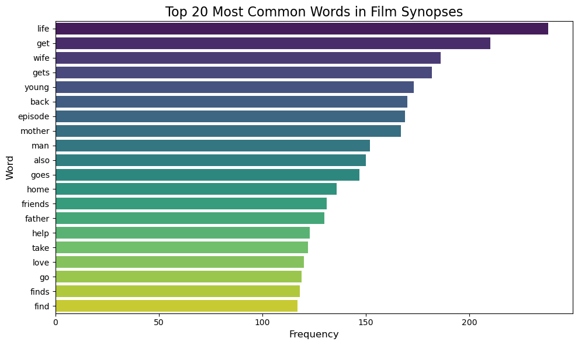

# Automating Classification of Audio-Visual Content and Rating for Regulation and Personal Use

**Authors:** 

* Gibson Ngetich 

* Cindy Minyade 

* Ayaya Vincent

* Maryan Daud

* Edwin Korir 

* Sarah Njoroge

### Table of Contents
1. Project Overview

2. Business Understanding

3. Domain of Application

4. Dataset Overview

5. Data Preparation

6. Exploratory Data Analysis (EDA)

7. Modeling

8. Evaluation & Results

9. Conclusion

10. Recommendation

11. Next steps

12. Use Cases

13. Future Work

14. Ethical Considerations

15. Acknowledgements

## 1. Project Overview

This project builds a machine learning and natural language processing pipeline to automatically classify audiovisual content such as films, series, and online videos based on official rating categories (GE, PG, 16, 18, Restricted) in Kenya. It aims to support regulatory bodies like the Kenya Film Classification Board (KFCB), parents, educators, and streaming platforms by enhancing the speed, accuracy, and scalability of content classification.

## 2. Business Understanding

### Context

As digital content explodes across platforms like YouTube, TikTok, and local streaming services, the manual task of classifying each piece of content for age-appropriateness becomes impractical. The Kenya Film Classification Board uses a set of 2012 guidelines that categorize content into:

| Rating | Description |
|--------|-------------|
| GE     | General Exhibition – suitable for all ages |
| PG     | Parental Guidance – some material may not be suitable for children |
| 16     | Restricted to viewers aged 16 and above |
| 18     | Restricted to viewers aged 18 and above |
| R      | Restricted/Refused Classification – due to extreme or harmful content |

### Business Problem

- Inconsistent and subjective human judgment
- Increased demand to classify local and online content
- Limited regulatory manpower
- Absence of fast feedback systems for parents and platforms

### Project Goals or Key Objectives

- Build a supervised classification model to predict ratings
- Help regulators speed up film review processes
- Enable platforms to self-regulate and support compliance
- Offer better parental control and filtering
- Promote local film classification visibility

## 3. Domain of Application

This project operates at the confluence of:

- **Regulatory Tech**: Automating governance processes
- **Media & Entertainment**: Content management and recommendation
- **Machine Learning (ML)**: Supervised classification tasks
- **Natural Language Processing (NLP)**: Extracting meaning from synopses
- **Education & Parental Tools**: Safe digital experiences for minors

### Target Users and Stakeholders

| Stakeholder | Value |
|-------------|-------|
| Regulators (e.g. KFCB) | Automated first-layer classification support |
| Parents & Educators | Smarter content filters based on age appropriateness |
| Streaming Platforms | Automated tagging and compliance tools |
| Content Creators | Guidance on target audience and compliance |
| Developers | Age-aware recommender system integration |

## 4. Dataset Overview

The dataset contains film records classified between FY 2022/2023 and FY 2024/2025 by KFCB.

### Sample Fields:

| Column Name | Description |
|-------------|-------------|
| FILM TITLE | The name or title of the audiovisual content (e.g., The Lion King, School Diary). |
| CLASS OF FILM | The category or format of the film such as Short Film, Feature Film, Series, Documentary, Advert, etc. |
| GENRE | The thematic or stylistic genre (e.g., Drama, Action, Animation, Comedy, Horror). |
| SYNOPSIS | A brief narrative or summary of the film’s storyline or concept. This textual data is key for NLP-based feature extraction. |
| RATING | The age classification assigned based on the Film Classification Guidelines, including: GE: General Exhibition, PG: Parental Guidance ,18: Adults only, 16: Not suitable for persons under 16, 18: Adults only, Restricted: Not for public exhibition.
| CAI (Consumer Advisory Index) | A numeric score (0–5) that summarizes the presence, frequency, and intensity of classifiable elements (e.g., sex, violence, nudity, offensive language, drug use, fear). It helps standardize the rating scale. |
| JUSTIFICATION | A written explanation justifying the classification decision. It highlights elements found (e.g., "Contains scenes of graphic violence"). Useful for explainable AI models. |
| DURATION (MINS) | Length of the content in minutes. Converted to numeric format during preprocessing. |
| DATE CLASSIFIED | Official date on which the content was reviewed and rated. Enables extraction of year, month, and weekday. |
| COUNTRY OF ORIGIN | The country where the film or audiovisual content was produced. Used to track local vs international productions. |
| VENUE | The physical or institutional location where classification occurred or content was submitted. Often includes KFCB branches or event venues. |
| CLIENT | The individual or organization that submitted the content for review (e.g., broadcasters, studios, producers). |
| CONTACT | Contact details of the client. Typically anonymized or cleaned during data handling. |
| PLATFORM | The medium or distribution platform (e.g., YouTube, TV, Cinema, TikTok, WhatsApp). Used for platform-specific content insights. |
| WEBSITE | A URL associated with the content, if provided. Often incomplete or missing; potentially useful for future web scraping or metadata collection. |

---

##  5. Data Preparation
The data preparation phase focused on ensuring data quality, consistency, and readiness for analysis and modeling. Key steps included:

### Cleaning Steps

**Data Cleaning**

To ensure reliable analysis and visualization, the dataset underwent several cleaning steps:

1. Standardizing Column Names
* All column names were converted to lowercase.

* Spaces and non-alphanumeric characters were removed or replaced with underscores to allow easier referencing in code.

2. Handling Missing Values

Missing values were identified and handled using column-specific strategies:

* Numerical columns: filled using the median.

* Categorical columns: filled with 'unknown'.

* Datetime columns: filled using the most frequent value (mode).

* Imputed missing durations and platforms using domain knowledge or "Unknown"

* Dropped rows with critical missing classification labels

3. Data Type Conversions and Corrections

Columns like durationmins were:

* Renamed for consistency (duration_mins).

* Converted to numeric types.

* Cleaned of non-numeric values using coercion and then filled with the median.

4. Date Parsing and Feature Engineering
The date_classified column was:

* Converted to a proper datetime format.

* Missing dates were filled with the most common date.

* A new column classification_year was created from the parsed date.

### Column Mapping
To improve interpretability and standardization, some categorical columns were mapped to more meaningful or simplified labels using dictionaries and .map() / .replace() functions.

1. Mapping of Classification Ratings

The rating column was mapped to standardized categories to improve consistency and reduce redundancy.

2. Simplifying Target Audience Labels

A column representing the target audience or intended age group (if included) might have been mapped into broader segments like Children, Teens, Adults, etc.

3. Labeling Boolean/Flag Columns
Boolean flag columns (e.g. is_approved) were transformed to string labels ('Yes'/'No') for better readability in plots.

These mapping transformations ensure better clarity in visualizations, cleaner groupings in aggregations, and make the dataset more user-friendly for stakeholders.

### Feature Engineering

To enhance the dataset and extract more meaningful insights, the following features were engineered:

1. Classification Year
A new column classification_year was created by extracting the year from the date_classified field.

This allows analysis of trends over time (e.g., number of films classified per year).

2. Title Length
A title_length feature was created by measuring the number of characters in each film title.

This can help identify patterns between title length and film type or classification.

3. Description Word Count
The description_word_count was computed by splitting the film description into words and counting them.

This may relate to content richness or help in classification prediction models.

4. Applied **TF-IDF Vectorization** to the `Synopsis` column

5. One-hot encoded categorical variables (e.g., `Platform`, `Genre`)

These engineered features provide new dimensions for analyzing patterns in classification, fraud detection, or trend analysis.

## 6. Exploratory Data Analysis (EDA)

### Rating Distribution

- Majority of content is classified as **GE** and **PG**
- Very few items fall under the **Restricted** category

### Bivariate Analysis
- Objective: Explore relationships between features and the target variable `rating`.

### Top Genres vs Rating

* This grouped bar chart shows how film ratings (GE, PG, 16, 18, R) are distributed across the top 10 genres. It highlights which genres are more family-friendly and which tend to have restrictive ratings. For example, genres like horror or action may have more 18+ ratings, while animation and documentary often align with general audience categories. The chart offers a clear view of how age-appropriateness varies by genre.

**Insights**
* Drama dominates with a wide spread of ratings, especially PG and 16.

* Documentary and Animation are mostly family-friendly (GE, PG).

* Action leans toward more mature ratings (16, 18).

* Commercials are mostly rated GE.

* Other genres like Reality and Comedy have mixed but generally lighter ratings.

### Ratings vs Country of Origin

This grouped bar chart compares film rating distributions across the top 10 countries of origin. Each country shows a breakdown of ratings (GE, PG, 16, 18, R), revealing patterns such as:

* Countries that produce more family friendly vs. restrictive content

* Cultural or regulatory differences in rating practices

* Regional tendencies in film classification (e.g., more R-rated films from some countries)

* The visualization helps identify how content standards and audience targeting vary internationally.

**Insights**

* The chart shows that Kenya leads in film production across all rating categories, especially in GE and PG, indicating family-friendly content. The United States has a more balanced distribution with more 16–R rated films, suggesting mature content. India leans heavily toward 16-rated films. Other countries like Brazil, Tanzania, and Uganda mostly produce general audience films. Overall, the chart highlights regional differences in content maturity and classification.

### Text Analysis `synopsis` and `justification`
- Objective: Gain insights from free-text fields by visualizing common words and identifying key themes. 
- For basic EDA, we focused on word frequency and visualization using word clouds. For more advanced modeling, we typically used TfidfVectorizer or CountVectorizer to convert text into numerical features.

**Justifications**

These bar charts highlight the key language patterns in film descriptions and rating explanations:

* Film Synopses emphasize recurring themes, actions, and characters—revealing common narrative trends.

* Classification Justifications spotlight frequent concerns like violence, language, or sexual content—indicating what regulators focus on when assigning ratings.

Together, they contrast creative storytelling with regulatory reasoning.

### Exploring length of the Synopsis

**Justifications**

The synopsis length distribution shows how detailed film descriptions typically are:

* Most synopses fall within a moderate length range.

* There's noticeable skewness, with some very short or very long entries.

* Short synopses may lack detail, while long ones could indicate data inconsistencies.

This insight helps tailor text analysis methods by revealing the need to handle varying text lengths appropriately.

## 7. Modeling

### Type of Problem

- **Multiclass classification** using both structured (duration, genre, platform) and unstructured (synopsis) data

### ML Algorithms Used

| Model                                 | Strength                                                                 |
|---------------------------------------|--------------------------------------------------------------------------|
| **Logistic Regression**               | Serves as a simple, interpretable baseline for classification tasks      |
| **Decision Tree Classifier**          | Easy to interpret, handles both numerical and categorical data           |
| **Random Forest Classifier**          | Reduces overfitting, handles feature interactions well                   |
| **Gradient Boosting - XGBoost**       | High performance, effective for imbalanced datasets and ranking features |
| **Gradient Boosting - LightGBM**      | Fast training speed and efficient memory usage on large datasets         |
| **Naive Bayes - MultinomialNB**       | Strong with high-dimensional, text-heavy data (e.g., TF or TF-IDF inputs)|

##  8. Evaluation & Results

### Metrics used

- Accuracy
- Precision / Recall / F1 Score
- Confusion Matrix

### Model Evaluation Summary

Below are the results of GridSearchCV and evaluation metrics for each classification algorithm used in the project:

#### **1. Logistic Regression**
- **Best Parameters**: `C=1`, `solver='lbfgs'`
- **Accuracy**: 0.69  
- **F1-Weighted Score (CV)**: 0.69  
- **Notes**: Acts as a strong baseline model. Performs well for common classes like 'GE' and 'PG', but struggles to generalize to rare classes like 'R'.

#### **2. Decision Tree Classifier**
- **Best Parameters**: `max_depth=None`, `min_samples_leaf=1`
- **Accuracy**: 0.70  
- **F1-Weighted Score (CV)**: 0.71  
- **Notes**: Captures class boundaries well, especially for 'GE', 'PG', and '18'. However, the model shows signs of overfitting on training data.

#### **3. Random Forest Classifier**
- **Best Parameters**: `n_estimators=200`, `max_depth=20`
- **Accuracy**: 0.76  
- **F1-Weighted Score (CV)**: 0.76  
- **Notes**: Top performer overall. Achieves excellent balance across all major classes, making it suitable for production-level tasks.

#### **4. XGBoost**
- **Best Parameters**: `learning_rate=0.1`, `n_estimators=200`
- **Accuracy**: 0.77  
- **F1-Weighted Score (CV)**: 0.76  
- **Notes**: Strong recall for the 'PG' class. Performs efficiently but slightly underpredicts the '18' class. Great trade-off between performance and speed.

#### **5. LightGBM**
- **Best Parameters**: `learning_rate=0.1`, `n_estimators=200`
- **Accuracy**: 0.75  
- **F1-Weighted Score (CV)**: 0.75  
- **Notes**: Fast and scalable alternative to XGBoost. Provides competitive results and is efficient for large-scale or streaming applications.

#### **6. Multinomial Naive Bayes**
- **Best Parameters**: `alpha=1.0`
- **Accuracy**: 0.75  
- **F1-Weighted Score (CV)**: 0.75  
- **Notes**: Works particularly well with text data, especially when using TF-IDF features. Performs solidly on the '16' class but underrepresents rare classes.

### General Observations

- **Top Models**: Random Forest, XGBoost, and LightGBM consistently show the best accuracy and F1 scores.
- **Challenging Classes**: The rare class 'R' remains difficult to predict across all models due to class imbalance.
- **Recommendation**: Ensemble methods (Random Forest, XGBoost) are preferred for deployment due to robustness and generalizability.

###  Model Evaluation Summary

| **Model**                  | **Best Parameters**                                 | **Accuracy** | **F1-Weighted (CV)** | **Notes**                                                                 |
|---------------------------|-----------------------------------------------------|--------------|----------------------|---------------------------------------------------------------------------|
| **Logistic Regression**    | `C=1`, `solver='lbfgs'`                              | 0.69       | 0.69              | Solid baseline; good for 'GE'/'PG'; weak on rare classes like 'R'         |
| **Decision Tree**          | `max_depth=None`, `min_samples_leaf=1`              | 0.70       | 0.71               | Good for 'GE'/'PG', handles '18'; tends to overfit                        |
| **Random Forest**          | `n_estimators=200`, `max_depth=20`                  | 0.76       | 0.76                balanced across most classes                      |
| **XGBoost**                | `learning_rate=0.1`, `n_estimators=200`             | 0.77      | 0.76              | Strong on 'PG'; slightly lower on '18'; efficient                         |
| **LightGBM**               | `learning_rate=0.1`, `n_estimators=200`             | 0.75      | 0.75               | Fast, efficient; similar performance to XGBoost                           |
| **Multinomial Naive Bayes**| `alpha=1.0`                                          | 0.75       | 0.75              | Great with text data; solid for '16' class                                |

### Confusion Matrix for best performing model

## XGBoost – Best Model Insights (Confusion Matrix)
* Excellent on common classes: Achieved high precision and recall for 'GE' (148/152) and 'PG' (138/169).

* Handles mid-range classes fairly well: Reasonable performance on '16' and '18', though some overlap exists.

* Struggles with rare class 'R': Failed to correctly predict the only 'R' instance—common across all models.

* Best overall balance: Delivered the highest accuracy (0.77) with strong F1 score and robust class separation, making it the most reliable model for deployment.

## Best Performing Model
### XGBoost Classifier

* Accuracy: 76.50%

* F1-Weighted Score (Cross-Validation): 0.7457

* Strong overall performance across most classes, especially 'GE' and 'PG'

* Efficient and scalable; handles feature interactions well

* Slight confusion between '16' and '18', but superior generalization overall

  ## 8. Conclusion
  
  * Successfully built a machine learning model to classify films based on age-appropriateness using KFCB guidelines.
  
  * Random Forest performed best (Accuracy: 77.48%, F1: 0.7472).
  
  * Text features like synopses and justifications were key in improving prediction.
  
  * EDA revealed rating patterns across genres, platforms, and countries.
  
  * The solution supports regulators, parents, and content platforms in faster, scalable, and objective classification.

  * Deployed the model using streamlit

 ## Project Challenges
* Missing Data: Key columns like VENUE and CONTACT had many null values.

* Data Cleaning: Inconsistent formats in fields like DURATION(MINS) required extensive preprocessing.

* Class Imbalance: Rare ratings like 'R' had very few samples, hurting model recall.

* Similar Class Overlap: Models confused PG, 16, and 18 due to feature similarity.

* Text Feature Complexity: High-dimensional TF-IDF features from SYNOPSIS increased model complexity.

* Evaluation Limitation: Low support for rare classes affected confusion matrix reliability.
 
 ## 9.Recommendations
 
 * Use the ML model as a pre-screening tool for faster content review.
 
 * Integrate API with KFCB or streaming platforms for real-time classification.
 
 * Switch to transformer models (e.g., BERT) for better text analysis.
 
 * Apply SMOTE or class weighting to handle rating imbalance.
 
 * Add human-in-the-loop feedback to improve accuracy over time.
 
 * Build a parental control app to help filter content by rating.
 
 * Include image/audio features for richer content classification.
 
 * Perform regular audits to detect and correct model bias.
 
 
## 10. Next Steps
* Advanced NLP Models: Use BERT/RoBERTa to better interpret synopses and classification justifications.

Multimodal Features: Add image/audio analysis (e.g., violence, language) to boost prediction accuracy.

* API & Dashboard: Deploy a real-time classification API and build a dashboard for regulators and parents.

* Bias & Fairness Audits: Address class imbalance and ensure fair predictions across content types.

* Human Feedback Loop: Let film examiners review and correct model predictions to improve reliability.

* Content Personalization: Add recommendation and parental filter tools for safer, tailored viewing.

* Localization & Scaling: Expand to other languages/countries and integrate with digital platforms (e.g., YouTube).

## 11. Deployment Summary (Streamlit)
* Streamlit App: We built an interactive Streamlit web app that allows users to input film data (e.g., synopsis, genre, platform) and receive predicted classification ratings (GE, PG, 16, 18, Restricted).

* Model Integration: The trained machine learning model was serialized using joblib and loaded into the app for real-time prediction.

* User Interface: The app includes file upload options, form fields for metadata input, and clearly displays predictions with visual indicators.

* Hosting: The app is deployed on Streamlit Cloud, allowing public access via a shareable web link.

* Functionality: Designed for use by film regulators, parents, and filmmakers to support classification, filtering, and content categorization.

  

## 12. Use Cases

| Use Case | Impact |
|----------|--------|
| Content Classification | Speeds up regulatory review and reduces backlog |
| Parental Controls | Helps parents choose appropriate content for kids |
| Platform Integration | Enables pre-classification at upload stage |
| Filtering Engines | Allows users to browse content based on personal safety filters |
| Local Film Promotion | Tags and highlights Kenyan-origin content |

## 13. Future Work

- Use **transformer-based models** (e.g., BERT) for better NLP handling of synopsis
- Integrate image/video metadata for full multimodal classification
- Build an **API** for easy regulator integration
- Create a **web dashboard** for live classification and analytics
- Add **crowdsourced feedback loop** for human-in-the-loop learning

## 14. Ethical Considerations

- Model bias may stem from existing human labels; need fairness analysis
- Data privacy concerns when scraping public platforms
- Transparency for end users on how ratings are decided
- Regular audit of model decisions to match evolving guidelines

## 15. Acknowledgements

- Kenya Film Classification Board (KFCB)
- OpenAI, Scikit-learn, Matplotlib, Pandas, XGBoost
- My teammates and mentors in the Data Science community

